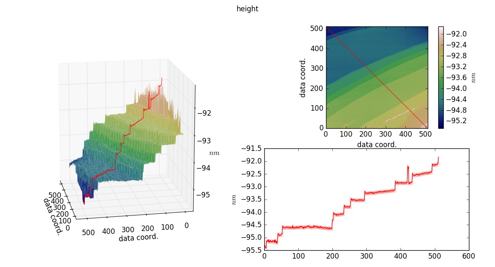

# Atomic-Force-Microscopy (AFM) - Interactive plot  with Matplotlib

## Description
Plot AFM-data as a 2D image, 3D surface and as a profile along a straight line. The line profile can be created interactively with ipython-widgtes.

## TODO

X- and Y-Coordiantes are in data-coordinates 

## Conclusion
This is a proof of concept. It works, but the matplotlib 3D-backend might be too slow.

